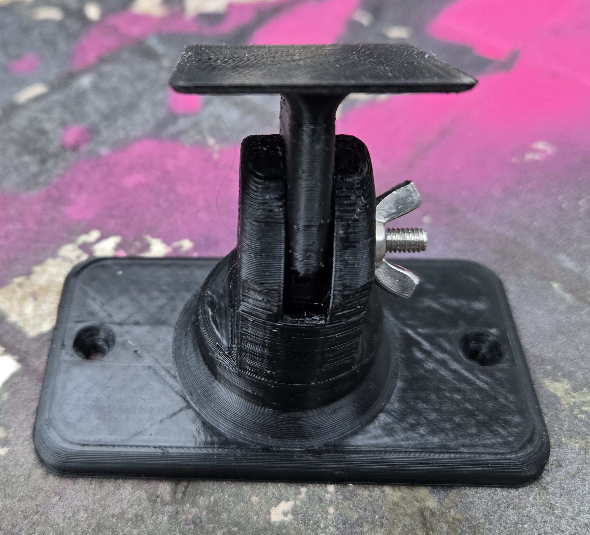
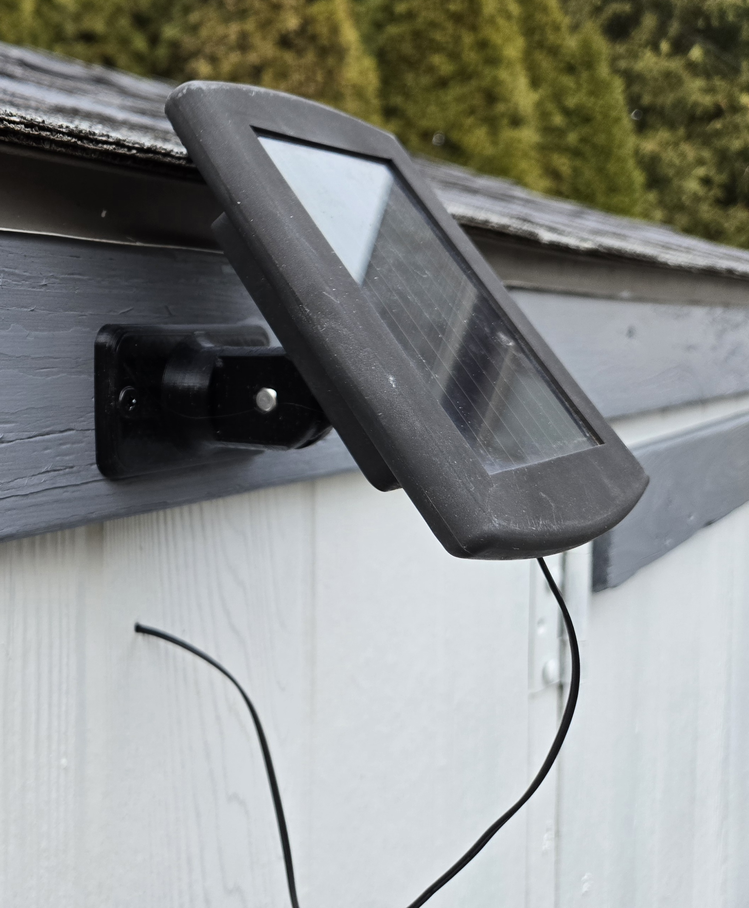
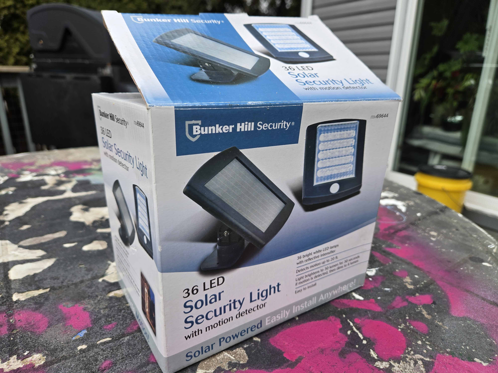

This is an OpenSCAD project which generates the mounting bracket for the Bunker Hill Solar Security Light as sold by Harbor Freight. The bracket consists of two parts, one which mounts to the wall and the other which mounts to the device. They are attached at the middle with a hex-head bolt, a washer and a wing-nut. This allows the device to be tilted up and down. One light uses two identical such brackets, one to mount the solar panel and the other to mount the light itself.

The brackets normally comes with the light. This is a replacement that I designed and printed when I broke the solar panel's bracket when painting my shed. I had the light several years and surprisingly it is still working great despite the battery being exposed to the cold of winter and heat of summer. The original solar panel bracket turning brittle from sun exposure is the only problem I have experienced so I decided to keep the light and replace the bracket. Now you may replace yours too if needed.

I did not realize while designing this that the light used the same bracket as the panel. If I had I might have re-designed the bracket to use a ball mount so that it could swivel left and right as well as up and down. I may revisit this at a future date.

Using OpenSCAD and the source code here you may adjust the bolt and/or mounting screw sizes. Of course you may also edit the code and use it for other projects as you wish within the limitations of the GPL license.  Make sure when cloning the repository to include submodules as this project does depend on one. Or, if you prefer, I have pre-rendered stl files sized for an M4 bolt and #8 screws available on Thingiverse at [https://www.thingiverse.com/thing:7269412/](https://www.thingiverse.com/thing:7269412/).

